# Backend PocketBase - MKG Khao Sat

Server mac dinh: `https://db.mkg.vn`.

Tai lieu nay mo ta schema dang dung cho app noi bo va cong khach hang.

## Ap Schema

Duong khuyen dung: dang nhap bang superuser PocketBase trong app, vao **Cai dat -> Quan ly team & nguoi dung -> Dung ngay**.

CLI van dung duoc, nhung chi la wrapper goi cung logic `provisionBackend()` cua app:

```bash
PB_EMAIL=founder@mkg.vn PB_PASSWORD='***' node scripts/pb-setup.mjs --dry-run
PB_EMAIL=founder@mkg.vn PB_PASSWORD='***' node scripts/pb-setup.mjs
```

Truoc khi sua schema, app/script tao backup schema vao may. Chay lai nhieu lan van an toan.

Neu backend chua du schema moi, client se **dung sync va giu pending tren may**. Day la chu y thiet ke: khong day kieu tuong thich cu nua vi kieu do tao record thieu `scope/team`, lam dong nghiep khong doc duoc.

## Schema Chinh

`survey_items`: du lieu noi bo cua nhan vien, mot record cho moi project/doc.

- `owner`, `owner_name`: nguoi tao/chu record.
- `scope`: `private` hoac `team`.
- `team`: doi duoc doc khi `scope = team`.
- `updated_ms`, `rev`, `schema_v`: dong bo hai pha va migrate anh.
- `photo`, `photo_hash`: anh tach khoi JSON de sync nhanh.
- `deleted`: dau cu con sot, du lieu xoa that se vao `deletions`.

`teams`: doi lam viec noi bo, gom `members`.

`shares`: link chia se cong khai bang ma khong doan duoc; link het han/thu hoi tra 404.

`deletions`: dau xoa toi thieu de may offline biet xoa theo sau khi record goc da bi DELETE that.

`customer_profiles`: anh xa tai khoan khach -> team tiep nhan. Khach khong la thanh vien team.

`customer_submissions`: hop thu snapshot khach gui, cho nhan vien duyet/nhap vao du lieu noi bo.

## So Do Phan Quyen

```mermaid
flowchart TD
    Superuser[Superuser PocketBase]
    Admin[Quan tri app<br/>role=admin]
    Staff[Nhan vien]
    Customer[Khach hang<br/>role=customer]
    Public[Nguoi co link share]

    Users[(users)]
    Teams[(teams)]
    Survey[(survey_items<br/>du lieu noi bo)]
    Shares[(shares)]
    Deletes[(deletions)]
    Profiles[(customer_profiles)]
    Submissions[(customer_submissions<br/>hop cho)]

    Superuser -->|dung schema / backup / sua moi bang| Users
    Superuser --> Teams
    Superuser --> Survey

    Admin -->|tao nhan vien, khach, gan team| Users
    Admin -->|quan ly thanh vien| Teams
    Admin -->|tao profile khach| Profiles

    Staff -->|doc/sua cua minh| Survey
    Staff -->|doc/sua khi scope=team va la member| Survey
    Staff -->|doc team minh| Teams
    Staff -->|xem hop thu team| Submissions
    Staff -->|import thanh du an noi bo| Survey
    Staff -->|ghi dau xoa| Deletes
    Staff -->|tao/thu hoi link cua minh| Shares

    Customer -->|doc profile cua minh| Profiles
    Customer -->|gui snapshot status=submitted| Submissions
    Customer -. khong doc/ghi .-> Survey
    Customer -. khong la member .-> Teams

    Public -->|view code hop le, chua het han| Shares
```



## Rule Cot Loi

`survey_items` list/view:

```text
(@request.auth.id != "" && @request.auth.role != "customer") &&
(owner = @request.auth.id || (scope = "team" && team != "" && team.members.id ?= @request.auth.id))
```

`survey_items` create:

```text
@request.auth.id != "" && @request.auth.role != "customer" && @request.body.owner = @request.auth.id
```

Khach hang bi chan o API rule, khong chi o giao dien. Neu khach co token va tu goi endpoint `survey_items`, server van tu choi.

## Luong Khach Hang

1. Quan tri mo **Quan ly team & nguoi dung**, chon team tiep nhan, tao tai khoan khach.
2. Gui cho khach link `/?customer=1`, ten dang nhap va PIN.
3. Khach tu do tren dien thoai, bam **Gui cho nhan vien**.
4. App tao record trong `customer_submissions`, idempotent theo `project.id + version`.
5. Nhan vien mo **Du lieu khach gui**, kiem tra, bam **Nhap vao du an noi bo**.
6. Du lieu sau khi nhap moi vao `survey_items` va di theo sync noi bo binh thuong.

## Du Lieu Truoc Khi Login

Lop local data tach rieng theo tai khoan IndexedDB.

- Nhan vien lam khi chua login: lan login dau se nhan du lieu anon vao tai khoan va giu hang doi sync.
- Tai khoan khach: **khong** nhan du lieu noi bo an danh tren may, de tranh dien thoai dung chung bi day nham du lieu cong ty sang khach.
- Dang xuat khong xoa local data; app van mo store gan nhat tren may.

Voi Android Chrome, khong xoa site data/clear storage/uninstall Chrome neu con ban chua sync. Mo dung domain app, dang nhap lai, bam sync hoac gui khach.

## Tao User Bang CLI

Sau khi provision, co the tao hang loat nhan vien bang script:

```bash
PB_EMAIL=founder@mkg.vn PB_PASSWORD='***' node scripts/pb-setup.mjs \
  --add-users "an@mkg.vn:Anh An,binh@mkg.vn:Chi Binh" --password "2580"
```

`--password` nhan PIN 4-8 so hoac mat khau that tu 8 ky tu. Neu bo trong, app tu sinh mat khau va in ra mot lan.

## Test

Chay `npm run dev` roi mo:

- `/test/sync.test.html` - sync hai pha, fail-closed khi backend cu.
- `/test/user.test.html` - tach du lieu theo tai khoan, cuu du lieu anon, khach khong nhan nham anon.
- `/test/customer.test.html` - login khach, gui snapshot, nhan vien duyet hop thu.
- `/test/admin.test.html` - superuser, quan ly team/user, da team.
- `/test/migrate.test.html` - di tru du lieu v2 -> v3.
- `/test/geometry.test.html`, `/test/elevation.test.html`, `/test/column.test.html`, `/test/pin.test.html` - cac lop tinh toan/UI phu.

Tieu de tab hien `N pass` hoac `N FAIL`.
